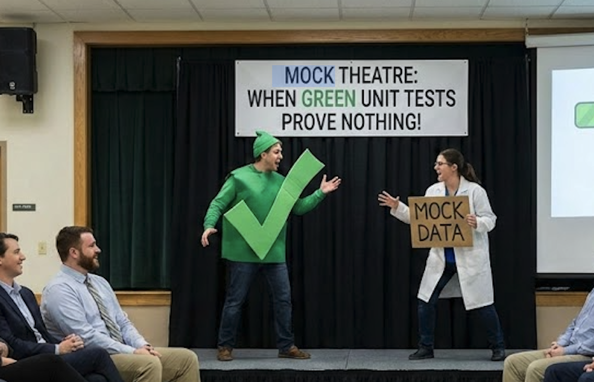

# Mock Theatre slides

This repo contains a single Slidev presentation for the unconference session
"Mock Theatre: when green tests mean nothing".



## Start here

- `slides.md` (full end-to-end deck, skip as needed)

## Local development (npm)

```sh
npm install
npm run dev
```

Open `http://localhost:3030` and press `p` for presenter mode.

## Build static slides

```sh
npm run build
```

The static site is generated in `dist/`.

## Docker (static hosting)

```sh
docker build -t mock-theatre-slides .
docker run -p 8080:80 mock-theatre-slides
```

## Docker (presenter mode)

```sh
docker build -f Dockerfile.dev -t mock-theatre-slides-dev .
docker run -p 3030:3030 mock-theatre-slides-dev
```

Open `http://localhost:3030` and press `p` for presenter mode.